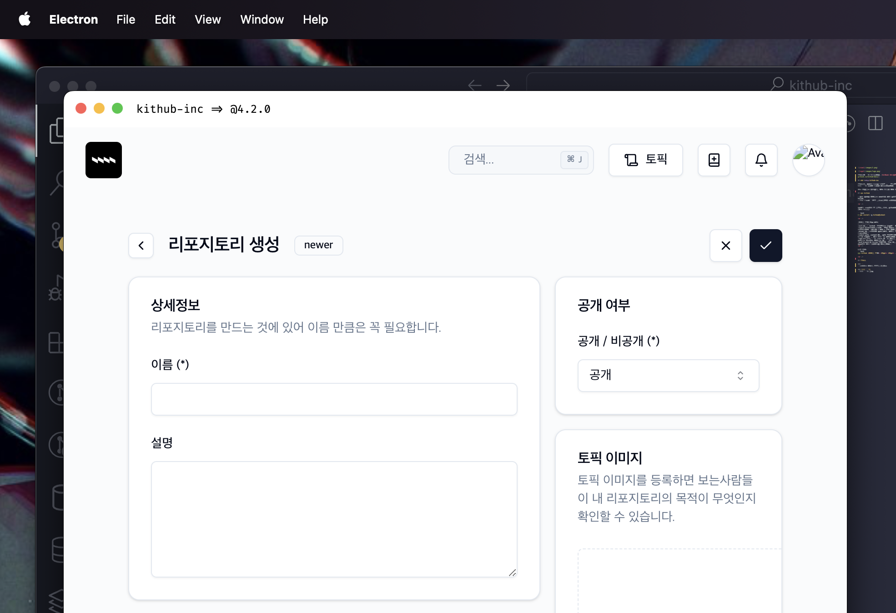

킷허브에 대해 소개합니다. [GitBook 바로가기](https://kithub.gitbook.io/kithub-docs/)

## ⁄⁄⁄ &nbsp;kithub-inc

킷허브는, 풀스택 개발자 한명이 만든 클라우트 컴퓨팅 겸 새로운 레포지토리 호스팅 서비스 프로젝트입니다.

바로 본론으로 들어가서, 기능 소개도 조금 해보겠습니다.

<br />

## npx kithub

> 가끔 가다가 커맨드를 입력해도 아무 작업이 수행되지 않는 경우가 있는데,
> 이는 액세스 토큰이 만료되었거나 로그인을 하지 않은 경우입니다.

<br />

npm에서 제공하는 이 라이브러리는, github의 git역할을 수행합니다. (기능 제한됨)

```bash
$ npm install @ice1/kithub
```
<br />

|커맨드 이름|인자|설명|
|---|---|---|
|init|없음|`.kithub` 디렉터리를 생성하고 기본설정을 수행합니다.|
|signin|accessToken|액세스 토큰을 인자로 받고 킷허브에 로그인합니다. (프로필 > 설정 > 보안 탭에서 액세스 토큰 복사 가능)|
|whoami|없음|로그인에 성공했다면, 설정한 이름 또는 이메일을 출력합니다.|
|commit|path, content|현재 작업 디렉터리에 해당하는 경로의 파일을 추가하고, 커밋 메시지를 설정합니다.|
|repo|url|레포지토리 링크를 그대로 복사한 후, 인자로 붙여넣으면 자동으로 인식하여 기본으로 푸쉬할 레포지토리를 설정할 수 있습니다.|
|push|branch|새 브랜치 이름이나, 이미 존재하는 브랜치 이름을 작성하면 커밋 일괄처리가 완료됩니다.|
<br />

사용 방법:
```bash
npx kithub <커맨드 이름> <인자1> <인자2> ...
```
<br />

## 킷허브



### 유저
- 로그인시 간단한 이메일 2차인증
- 디바이스 등록, 삭제
- 브라우저 알림

### 레포지토리
- 레포지토리 생성, 수정, 스타
- 이슈 생성, 댓글 작성, 언급, 하트

<br />

## 컨트리뷰팅

자세한 사항은 [CONTRIBUTING.md](CONTRIBUTING.md) 참고 바랍니다.

<br />

## 할 일

- [ ] 백엔드 보안 점검 (파라미터 검사)
- [ ] 레포지토리 포크 & 풀리퀘스트
- [ ] 수정 및 삭제
- [ ] 알림 분리
- [ ] 팔로워, 팔로잉 뷰어
- [ ] 검색
- [ ] 레포지토리 설명 장문으로 했을 때 버튼 안먹힘
- [ ] 유저 bio 수정